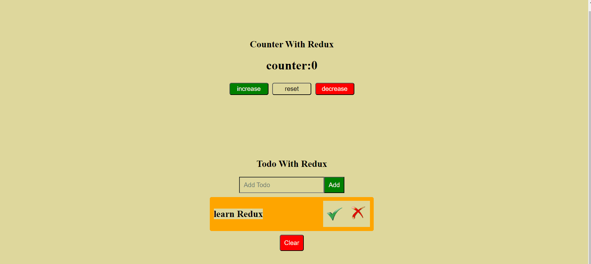
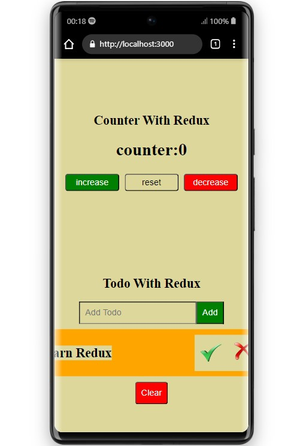
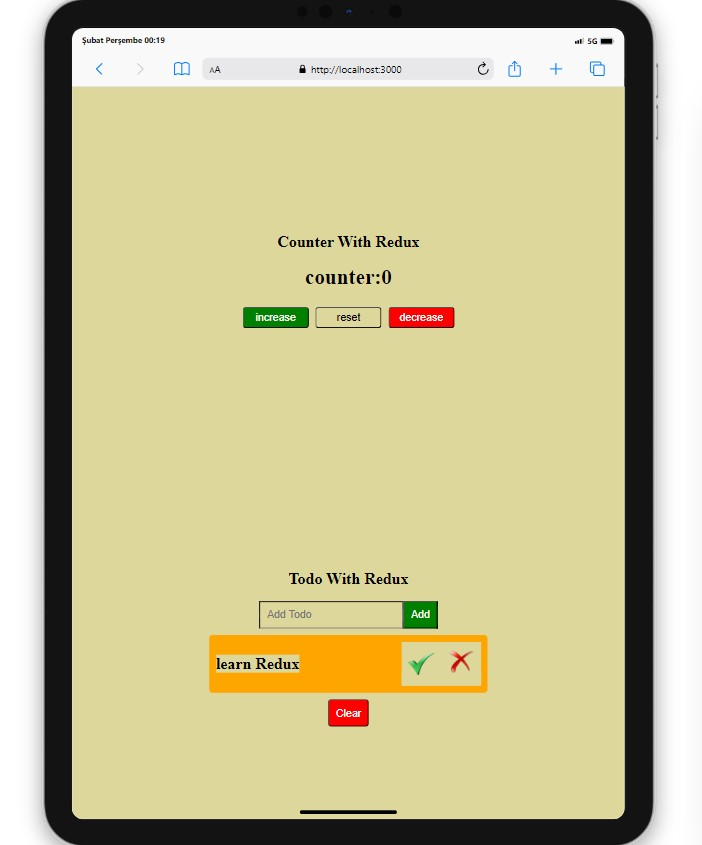
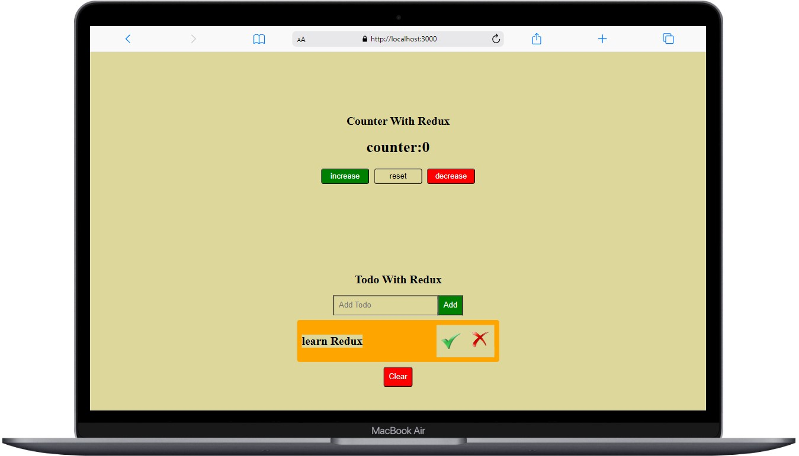

# React Redux Works

  

## Live Demo 👓
- [React Redux Works](https://react-redux-works.vercel.app/)

## About the Project

This application contains a counter and a to do list. The purpose here is to make and run this application using React Redux.

## Table of Contents

- [Features](#features)
- [Usage](#usage)
- [Screenshots](#screenshots)

## Usage

1. Open the web page in a browser.
2. Increase or decrease the counter and press reset to reset it.
3. In the To Do List, write the task or goal you want and tick or delete it.

## Screenshots

  
  
  

## Compatibility

The project is compatible with both wide-screen computers and mobile devices.